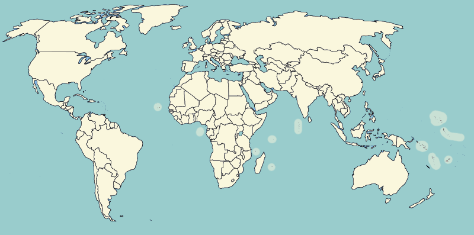

# world-countries-capitals

<!-- 

 -->

#### A simple [NPM](https://www.npmjs.com/package/world-countries-capitals) package to get capitals, currency, native language etc. of all the countries in the world



## Getting started

[](https://nodei.co/npm/world-countries-capitals/)

## Installation

[](https://docs.npmjs.com/getting-started/installing-npm-packages-locally) [](https://nodejs.org/en/) [](https://www.npmjs.com/package/world-countries-capitals)

This is a [Node.js](https://nodejs.org/en/) module available through the
[npm registry](https://www.npmjs.com/).

Before using, [download and install Node.js](https://nodejs.org/en/download/).

Installation is done using the
**[`npm install`](https://docs.npmjs.com/getting-started/installing-npm-packages-locally)** command:

```bash
$ npm i world-countries-capitals --save
```

## Usage

---

- **getAllCountryDetails()** This method returns an **array of objects** of all countries, each containing **country**, **capital**, **currency** and **native_language**.

```json
    [
        {
            "country": "Afghanistan",
            "capital": "Kabul",
            "currency": "Afghani",
            "native_language": "Dari Persian, Pashto"
        },
        {
            "country": "Albania",
            "capital": "Tirane",
            "currency": "Lek",
            "native_language": "Albanian"
        },

        ...
    ]
```

---

- **getAllCountries()** This method returns an **array** of **names** of all countries.

```javascript
    [
        'Afghanistan',
        'Albania',
        'Algeria',
        'Andorra',
        'Angola',
        'Antigua & Barbuda',
        'Argentina',
        'Armenia',
        'Australia',
        'Austria',
        'Azerbaijan',
        ...
    ]
```

---

- **getCountiesByLanguage(languageSpoken)** This method returns an **array of objects**, each containing **country**, **capital**, **currency** and **native_language** sorted by the _languageSpoken_.

Response for languageSpoken = 'Hindi'

```javascript
[
	{
		country: 'Fiji',
		capital: 'Suva',
		currency: 'Fijian Dollar',
		native_language: 'english, bau fijian, hindi',
	},
	{
		country: 'India',
		capital: 'New Delhi',
		currency: 'Indian Rupee',
		native_language: 'hindi, english',
	},
];
```

---

- **getCountryDetailsByName(countryName)** This method returns an **array of objects**, each containing **country**, **capital**, **currency** and **native_language** sorted by the _name of the country_ .

Response for countryName = 'india'

```javascript
[
	{
		country: 'india',
		capital: 'New Delhi',
		currency: 'Indian Rupee',
		native_language: 'Hindi, English',
	},
];
```

---

- **getCountryDetailsByCapital(capital)** This method returns an **array of objects**, each containing **country**, **capital**, **currency** and **native_language** sorted by the _capital_ .

Response for capital = 'delhi'

```javascript
[
	{
		country: 'India',
		capital: 'new delhi',
		currency: 'Indian Rupee',
		native_language: 'Hindi, English',
	},
];
```

---

- **getRandomCountry()** This method returns a random country everytime.

```bash
» node app.js
Tuvalu

» node app.js
Bhutan

» node app.js
Saudi Arabia
```

##### where app.js is the fie containing the function call.

---

- **getNRandomCountriesData(n)** This method returns an array having **n** random country objects, each object containing **country**, **capital**, **currency** and **native_language**.

Response for n = 3

```javascript
[
	{
		country: 'Burundi',
		capital: 'Bujumbura',
		currency: 'Burundi Franc',
		native_language: 'Kirundi, French',
	},
	{
		country: 'Palau',
		capital: 'Melekeok',
		currency: 'United States Dollar',
		native_language: 'English, Palauan',
	},
	{
		country: 'Dominican Republic',
		capital: 'Santo Domingo',
		currency: 'Dominican Peso',
		native_language: 'Spanish',
	},
];
```

---


# Want to contribute?

<!-- [](https://github.com/bhatvikrant/world-countries-capitals/issues) -->

> Please check issues **[here](https://github.com/bhatvikrant/world-countries-capitals/issues)**!

---

## License


---


## Let's get connected

[](https://twitter.com/vikrantbhat1022)

[](https://github.com/bhatvikrant/)

[](https://www.linkedin.com/in/vikrant-bhat-2b6221189/)

<hr>

[](https://github.com/bhatvikrant/world-countries-capitals) [](https://github.com/bhatvikrant/world-countries-capitals) [](https://github.com/bhatvikrant/world-countries-capitals) [](https://github.com/bhatvikrant/world-countries-capitals)
